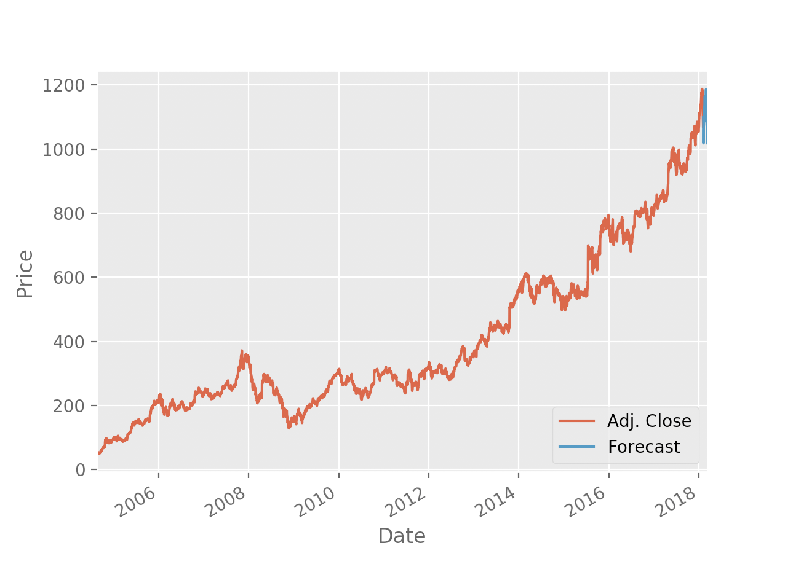
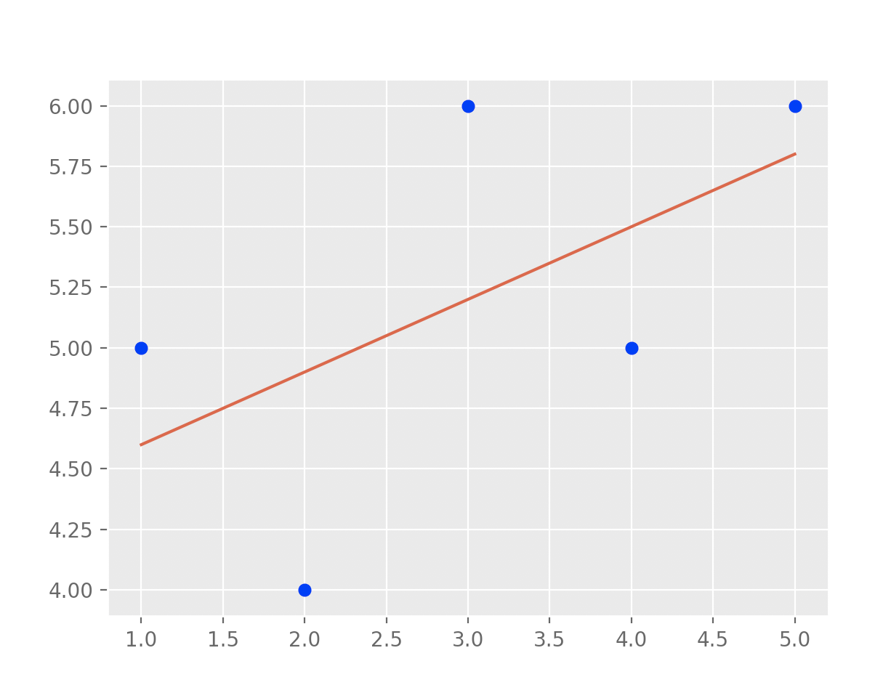
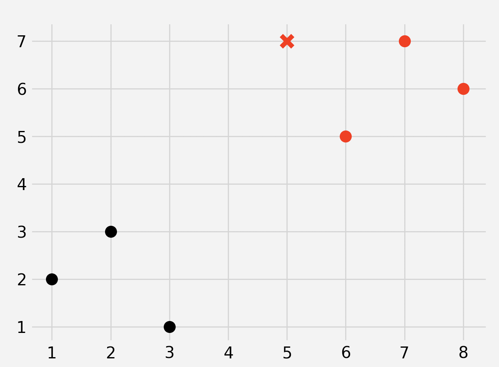
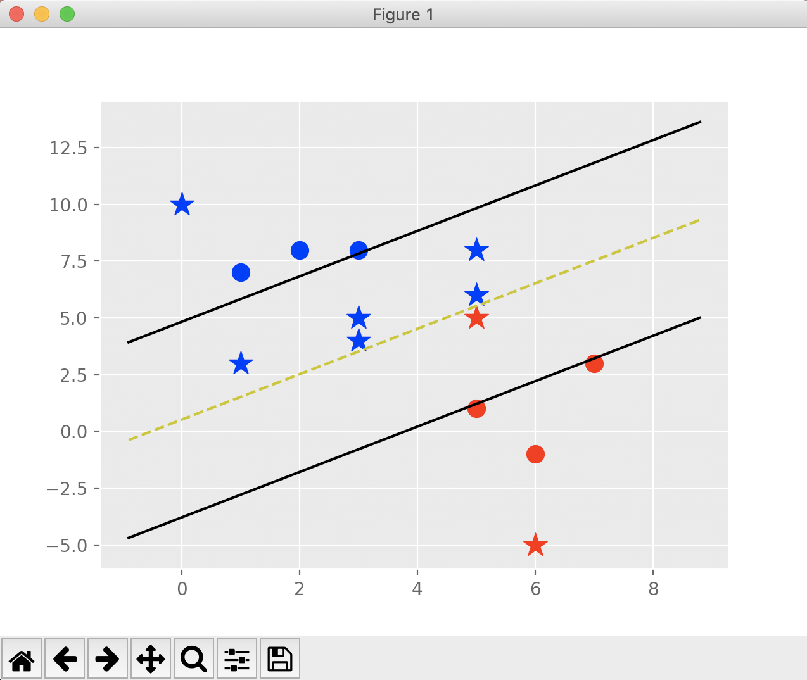
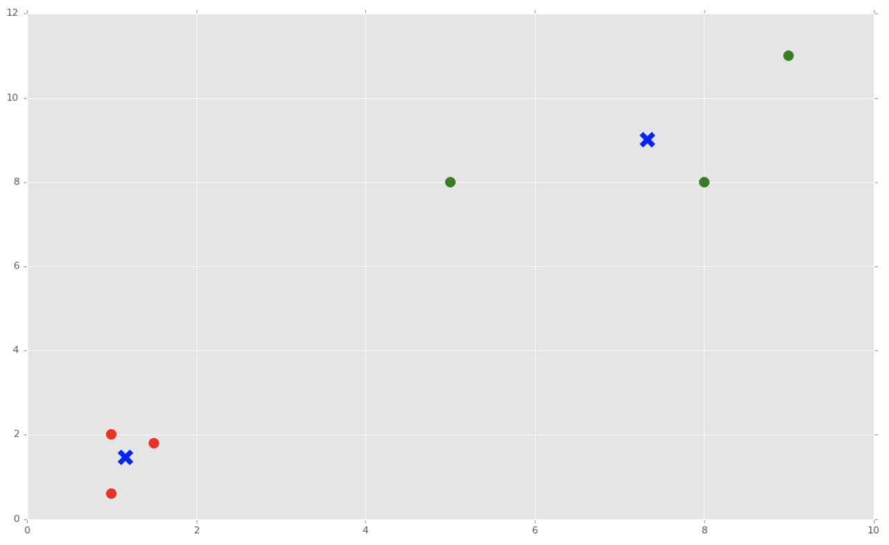
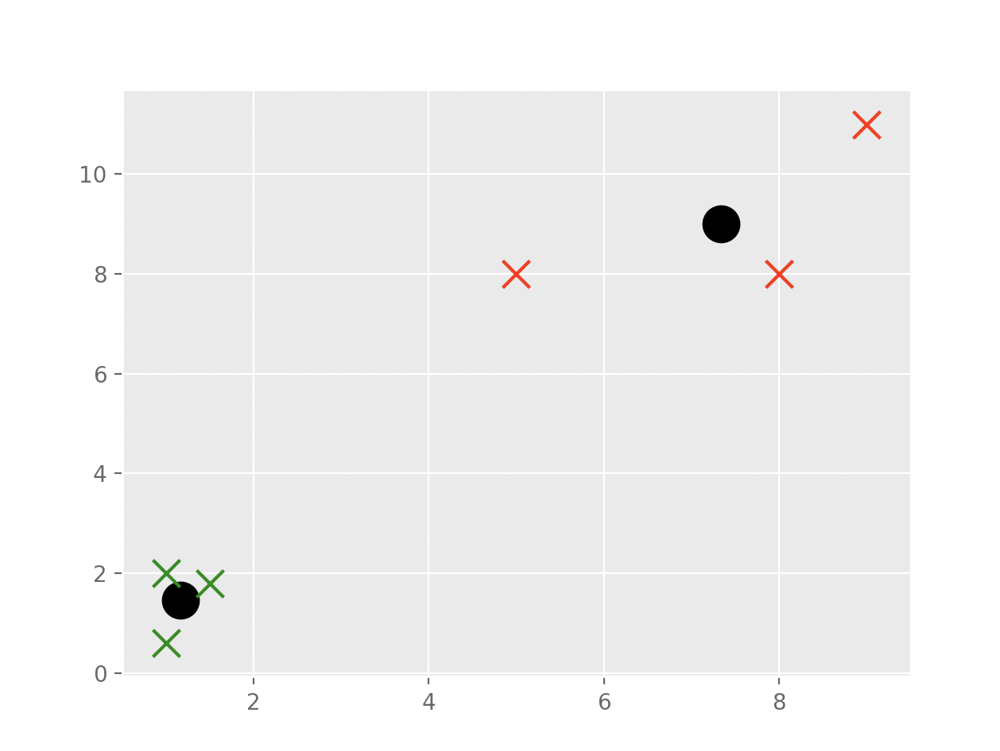
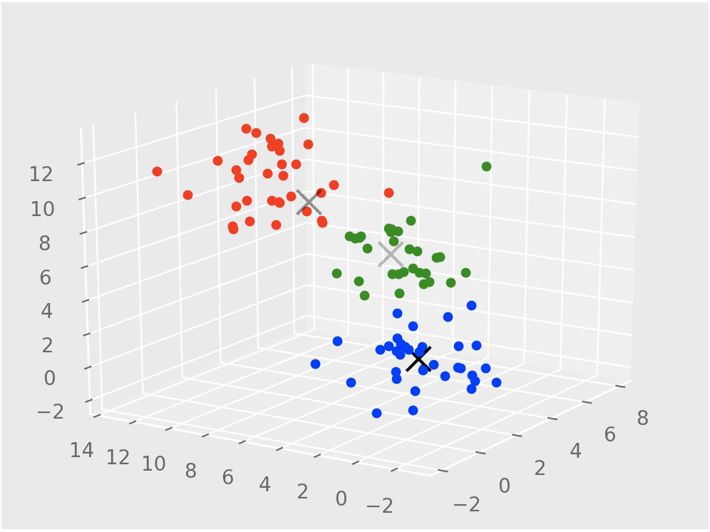
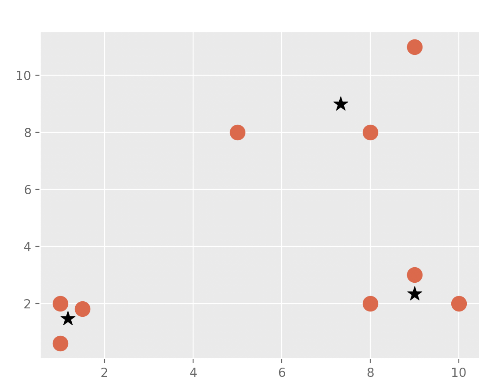

Notice: The code from this repository was made by following a youtube series by Sentdex. The code is very similar to his and i have only made minor edits to suit my datasets/preferences.

  
Linear Regression with scikitlearn

  [Linear regression using scikitlearn](/regression)
  =================

  
  1. Broughtt in the data set via quandl and cleaned it up to use features that provided valuable insight. I also created my own feature which i thought to be useful
  2. Split the data into training and testing where testing was 20% of the data
  3. Trained the Linear regression classifier provided in scikitlearn
  4. Plotted results
  5. Stored the model in a pickle file so i wouldn't have to retrain everytime i wanted to predict
  6. Modified the code to load in pickle file instead of retrain.

  
Linear Regression from scratch

  [Linear regression from scratch](/regression_from_scratch)
  =================

  

  1. Got the formulas for needed to find the gradient and intercept and coded a function for it
  2. Created 2 test arrays to use and plotted the data in matplotlib
  3. Plotted the regression line to see if it fit the data
  4. Coded a function for the coefficient of determination to see if our line fit the data well

  
K Nearest Neighbors

  [KNN](/knn)
  =================

  1. Retrieved dataset from UCI database online
  2. Replaced all the empty columns with a fixed value
  3. Dropped the id column as it is not contributing any useful info to our algorithm
  4. Defined features and target variable
  5. Split the dataset into training and test set
  6. Ran the KNN classifier from scikitlearn

  
K Nearest Neighbors from Scratch (with comparison of scikitlearn)

  [KNN](/knn_from_scratch)
  =================

  

  1. Created a list to store the distances from new point to all others using euclidean distance formula
  2. Sorted the list
  3. Chose the top k elements from the sorted list
  4. Plotted the data using matplotlib, with the new element as a cross in the colour of the group it is in

  The accuracy of mine and scikitlearn's algorithm would be near identical when run on a large enough sample size. However the implementation that scikitlearn has is much more optimised than mine. Firstly, with mine i am doing the euclidean distance from test point to all the dataset points with runtime O(n) however they are using a radius technique where they consistently expand a radius and find the closest points like that. They also use multithreaded code to run their code much faster by running code in parallel.

  
SVM

  [SVM](/svm)
  =================

  1. Retrieved dataset from UCI database online
  2. Replaced all the empty columns with a fixed value
  3. Dropped the id column as it is not contributing any useful info to our algorithm
  4. Defined features and target variable
  5. Split the dataset into training and test set
  6. Ran the SVM classifier from scikitlearn

  
SVM from scratch

  [SVM](/svm_from_scratch)
  =================

  

  
K means

  [K means](/kmeans)
  =================

  
  1. Read in dataset using pandas from excel file
  2. Do some data formatting like dropping useless columns and removing empty cells
  3. Converted all non numerical data into quantitative data
  4. Removed the survived column from the input features and done feature scaling
  5. Made the survived column the target column
  6. Ran K means with 2 clusters
  7. Split the data into 2 clusters
  8. Predicted whether people would survive depending on their other qualities

  
K means from scratch

  [K means from scratch](/kmeans_from_scratch)
  =================

  
  1. Define the centroids
  2. Work out distances to each point and classify into k groups
  3. Find the euclidean mean of the points in each group
  4. Repeat the process until you dont see any movement in centroids or have reached the max iterations
  5. Plot centroids and data

  
Mean Shift

  [Mean Shift](/meanshift)
  =================

  
  1. We generate 100 data examples around our defined centres
  2. We run meanshift on these generated points
  3. Plot our points and centroids in 3d using matplotlib

  
Mean Shift from scratch

  [Mean Shift](/meanshift_from_scratch)
  =================
  
  
  1. Set all points as centroids at first
  2. Loop through all the points within the radius of each centroid and group them
  3. Find the mean centroid of all the the points within the radius
  4. Repeat the process until you converge
  5. With this implementation, we choose the radius however we can also implement an algorithm to automatically generate it

